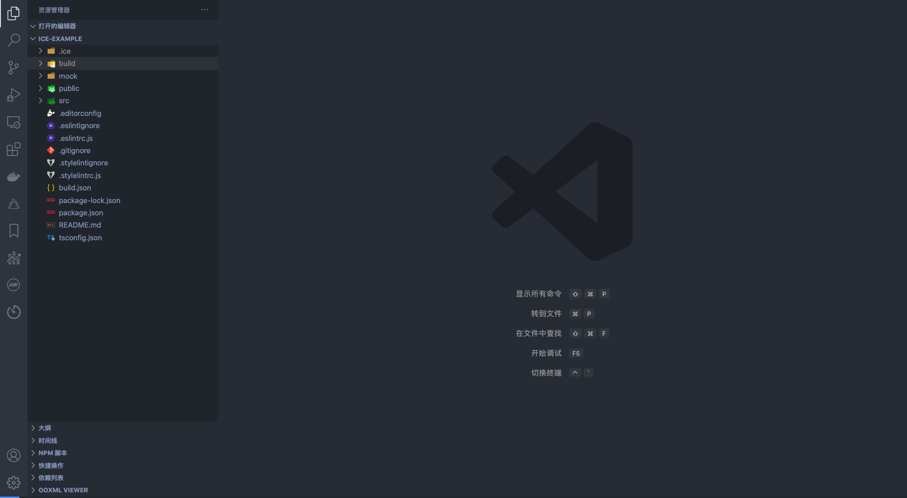
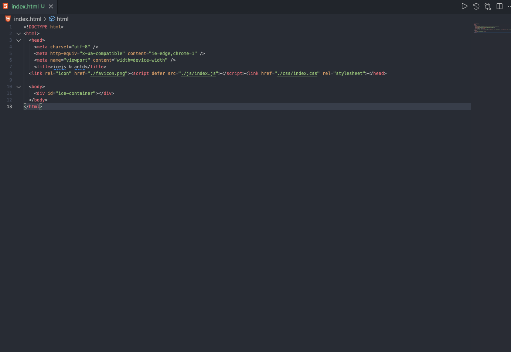
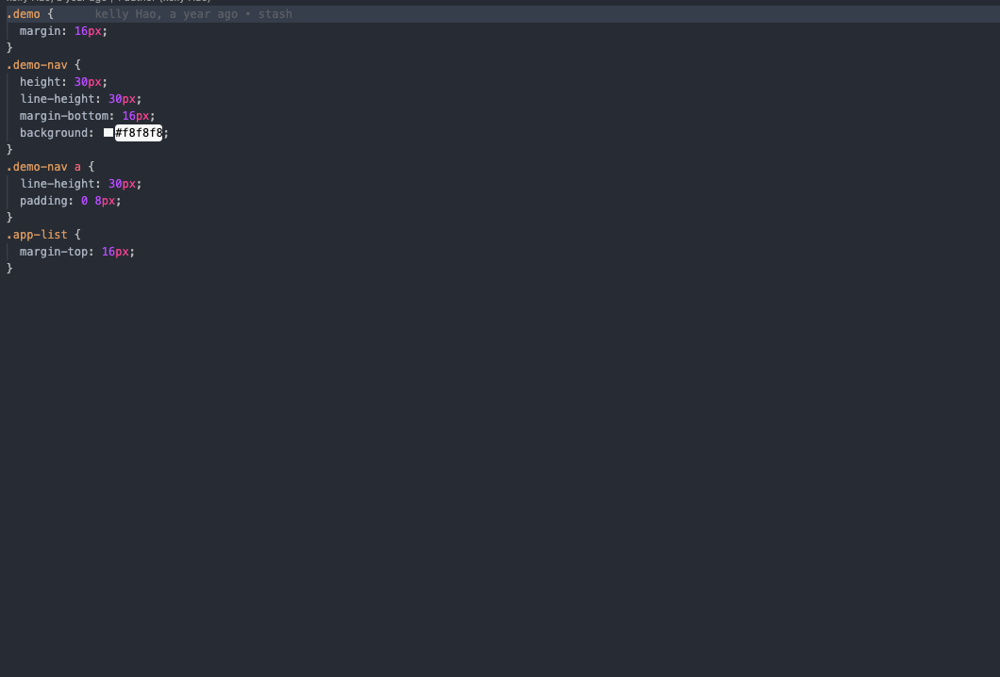
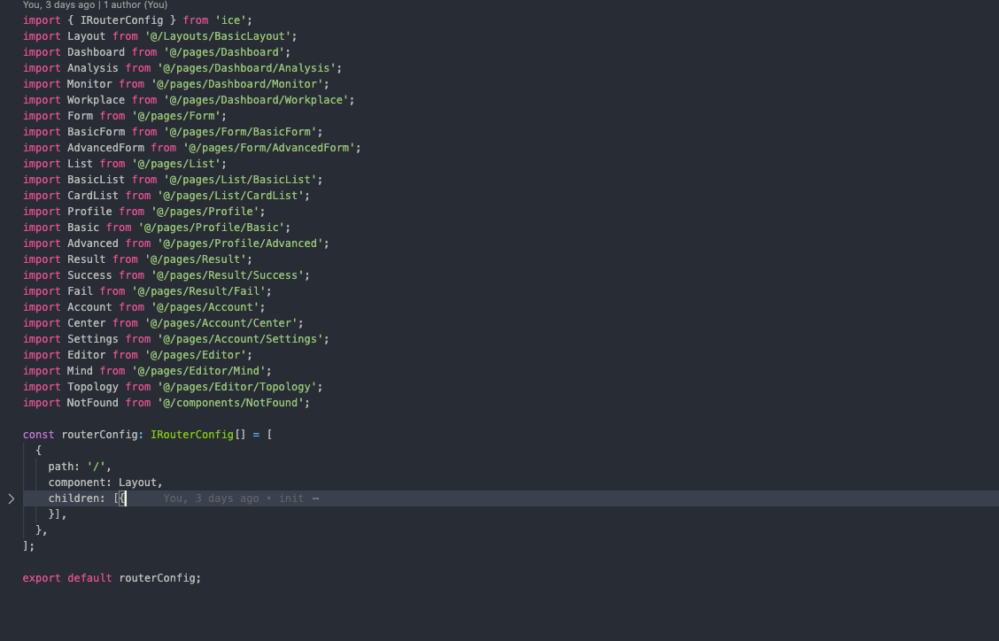
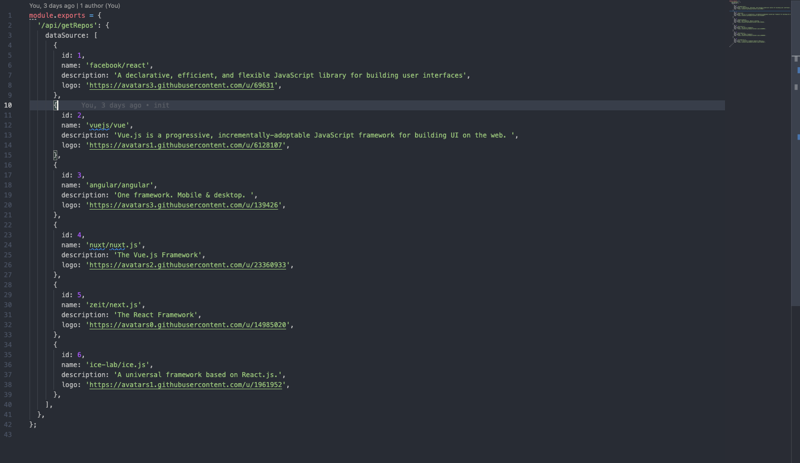
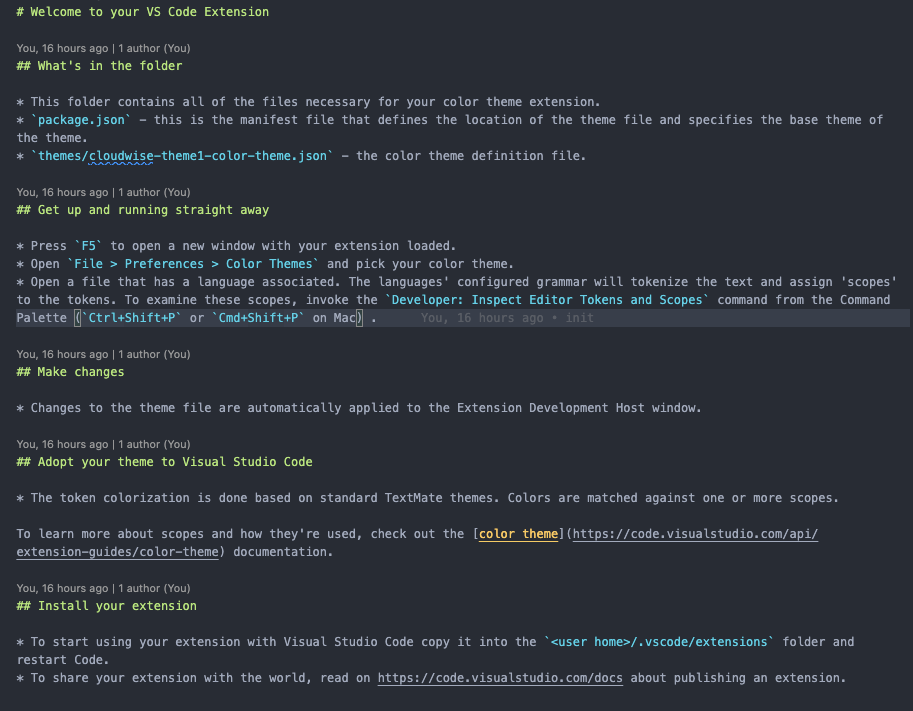

  

<h1 align="center">
  G Theme for VS Code
</h1>

  A cool, dark theme for <a href="https://github.com/gaoxuerong/G">VS Code</a>.

  
  
  
  
  

# Installation via VS Code
1.Open Extensions sidebar panel in VS Code. `View → Extensions`

2.Search for G

3.Click Install to install it

4.Click Reload to reload the editor

5.Code > Preferences > Color Theme > G

<h2>
  panel
</h2>

<h2>
  HTML
</h2>

<h2>
  less/css
</h2>

<h2>
  ts_js
</h2>

<h2>
  js
</h2>

<h2>
  JSON
</h2>

<h2>
  readme
</h2>

# For more information
* [Visual Studio Code's Markdown Support](http://code.visualstudio.com/docs/languages/markdown)
* [Markdown Syntax Reference](https://help.github.com/articles/markdown-basics/)

**Enjoy!**
